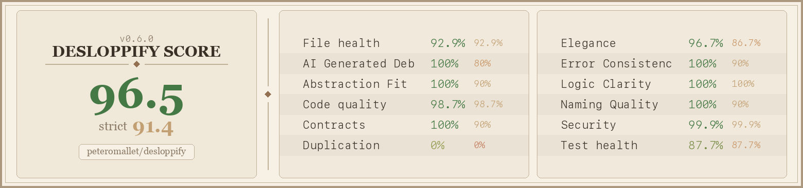

# Desloppify - agent tools to make your codebase 🤌

Detects subjective and mechanical code-base issues - everything from poor quality abstractions and inconsistent naming, to file complexity and duplication. Once identified, it tracks issues, and helps you work with your agents to relentlessly solve them. Currently supports 28 languages — full plugin depth for TypeScript, Python, C#, Dart, and GDScript; generic linter + tree-sitter support for Go, Rust, Ruby, Java, Kotlin, and 18 more.

Every scan generates a scorecard badge you can add to your README — here's the one for this repo. Strict score counts open + wontfix debt; ignored findings are tracked separately:



Adding a new language plugin? See `desloppify/languages/README.md`.

## For your agent's consideration...

Copy-paste into any AI coding agent (Cursor, Codex, OpenCode, etc.):

```
Install or update desloppify, then scan this codebase for code quality issues (dead code,
duplication, complexity, smells). It tracks findings and reports a health score.

pip install --upgrade git+https://github.com/peteromallet/desloppify.git
desloppify scan --path .
desloppify status
desloppify next

# If subjective scores feel stale or inflated, force a clean baseline:
desloppify scan --path . --reset-subjective

--path is the directory to scan (use "." for the whole project, or "src/" etc).
Language is auto-detected. To override: desloppify --lang python scan --path .
(note: --lang goes BEFORE the subcommand)

Fix what it finds, then "desloppify resolve fixed <id> --note 'what changed' --attest 'I have actually improved how [WHAT YOU IMPROVED EXPLICITLY] enough to honestly justify a score of [SCORE] and I am not gaming the score.'" and rescan.
For false positives: "desloppify resolve wontfix <id> --note 'reason' --attest 'I have actually improved how [WHAT YOU IMPROVED EXPLICITLY] enough to honestly justify a score of [SCORE] and I am not gaming the score.'" (note is required — don't skip work; attestation must include the keywords "I have actually" and "not gaming").
Keep going until all issues are resolved. If you notice anything wrong or confusing about
desloppify itself, tell me and ask if I want you to log an issue. If you need to understand
how desloppify works or debug an issue: git clone https://github.com/peteromallet/desloppify.git /tmp/desloppify

If you're Claude Code, also run:
mkdir -p .claude/skills/desloppify && { curl -fsSL https://raw.githubusercontent.com/peteromallet/desloppify/main/docs/SKILL.md; printf '\n\n'; curl -fsSL https://raw.githubusercontent.com/peteromallet/desloppify/main/docs/CLAUDE.md; } > .claude/skills/desloppify/SKILL.md

If you're Codex, also run:
mkdir -p .agents/skills/desloppify "${CODEX_HOME:-$HOME/.codex}/skills/desloppify" && { curl -fsSL https://raw.githubusercontent.com/peteromallet/desloppify/main/docs/SKILL.md; printf '\n\n'; curl -fsSL https://raw.githubusercontent.com/peteromallet/desloppify/main/docs/CODEX.md; } | tee .agents/skills/desloppify/SKILL.md > "${CODEX_HOME:-$HOME/.codex}/skills/desloppify/SKILL.md"
```

## From Vibe Coding to Vibe Engineering

Vibe coding gets things built fast. But the codebase accumulates debt — tangled dependencies, inconsistent patterns, abstractions that don't make sense — and eventually progress slows, bugs get harder to fix, and new features become a pain.

Traditional tools catch the mechanical stuff: dead code, unused imports, complexity metrics. That's table stakes. The real problems are subjective and structural — poor module boundaries, convention drift, error handling that's inconsistent across the codebase, naming that misleads. These are the things that actually make a codebase hard to work with, and no linter can see them.

LLMs are now good enough to recognize these problems when asked the right questions. Desloppify is the harness that asks those questions — structured prompts about architecture, design quality, convention consistency — and tracks the answers as scored findings alongside the mechanical detections. The score is weighted heavily toward these subjective insights because that's where the real leverage is.

Mechanical detection and auto-fix is handled automatically. For the rest — the stuff that needs taste — it gives your agent a prioritized shortlist. You decide what to fix and what to mindfully ignore. The goal is a single score that combines both objective and subjective metrics — a real measure of codebase health, not just lint output.

If you'd like to join a community of vibe engineers who want to build beautiful things, [come hang out](https://discord.gg/aZdzbZrHaY).


---

<details>
<summary><strong>Stuff you probably won't need to know</strong></summary>

#### Commands

| Command | Description |
|---------|-------------|
| `scan [--reset-subjective]` | Run all detectors, update state (optional: reset subjective baseline to 0 first) |
| `status` | Score + per-tier progress |
| `show <pattern>` | Findings by file, directory, detector, or ID |
| `next [--tier N] [--explain]` | Highest-priority open finding (--explain: with score context) |
| `resolve <status> <patterns>` | Mark fixed / wontfix / false_positive / ignore |
| `fix <fixer> [--dry-run]` | Auto-fix mechanical issues |
| `review --prepare` | Generate subjective review packet (`query.json`) |
| `review --import <file>` | Import subjective review findings |
| `issues` | Review findings queue (list/show/update) |
| `zone` | Show/set/clear zone classifications |
| `config` | Show/set/unset project configuration |
| `move <src> <dst>` | Move file/directory, update all imports |
| `detect <name>` | Run a single detector raw |
| `plan` | Prioritized markdown plan |
| `tree` | Annotated codebase tree |
| `viz` | Interactive HTML treemap |
| `dev scaffold-lang` | Generate a standardized language plugin scaffold |

#### Detectors

**TypeScript/React**: logs, unused, exports, deprecated, large, complexity, gods, single_use, props, passthrough, concerns, deps, dupes, smells, coupling, patterns, naming, cycles, orphaned, react

**Python**: unused, large, complexity, gods, props, smells, dupes, deps, cycles, orphaned, single_use, naming

**C#/.NET**: deps, cycles, orphaned, dupes, large, complexity

#### Tiers & scoring

| Tier | Fix type | Examples |
|------|----------|----------|
| T1 | Auto-fixable | Unused imports, debug logs |
| T2 | Quick manual | Unused vars, dead exports |
| T3 | Needs judgment | Near-dupes, single_use abstractions |
| T4 | Major refactor | God components, mixed concerns |

Score is weighted (T4 = 4x T1). Strict score penalizes both open and wontfix.

#### Configuration

| Variable | Default | Description |
|----------|---------|-------------|
| `DESLOPPIFY_ROOT` | cwd | Project root |
| `DESLOPPIFY_SRC` | `src` | Source directory (TS alias resolution) |
| `--lang <name>` | auto-detected | Language selection (each has own state) |
| `--exclude <pattern>` | none | Path patterns to skip (repeatable: `--exclude migrations --exclude tests`) |
| `--no-badge` | false | Skip scorecard image generation |
| `--badge-path <path>` | `scorecard.png` | Output path for scorecard image |
| `DESLOPPIFY_NO_BADGE` | — | Set to `true` to disable badge via env |
| `DESLOPPIFY_BADGE_PATH` | `scorecard.png` | Badge output path via env |

Project config values (stored in `.desloppify/config.json`) are managed via:
- `desloppify config show`
- `desloppify config set target_strict_score 95` (default: `95`, valid range: `0-100`)
- `desloppify config set badge_path scorecard.png` (or nested path like `assets/health.png`)

#### Adding a language

Use the scaffold workflow documented in `desloppify/languages/README.md`:

```bash
desloppify dev scaffold-lang <name> --extension .ext --marker <root-marker>
```

Detect command keys are standardized to snake_case. CLI compatibility aliases
like `single-use` and legacy `passthrough` are still accepted.
Standard plugin shape: `__init__.py`, `commands.py`, `extractors.py`, `phases.py`,
`move.py`, `review.py`, `test_coverage.py`, plus `detectors/`, `fixers/`, and `tests/`.
Validated at registration. Zero shared code changes.

#### Architecture

```
engine/detectors/            ← Generic algorithms (zero language knowledge)
hook_registry.py             ← Detector-safe access to optional language hooks
languages/_framework/runtime.py    ← LangRun (per-run mutable scan state)
languages/_framework/base/         ← Shared framework contracts + phase helpers
languages/_framework/generic.py    ← generic_lang() factory for tool-based plugins
languages/_framework/treesitter/   ← Tree-sitter integration (optional)
languages/<name>/            ← Language config + phases + extractors + detectors + fixers
```

Import direction: `languages/` → `engine/detectors/`. Never the reverse.
`LangConfig` stays static; runtime state lives on `LangRun`.

#### Command-Layer Boundaries

Command entry modules are intentionally thin orchestrators:

- `desloppify/app/commands/review/cmd.py` delegates to
  `desloppify/app/commands/review/prepare.py`, `desloppify/app/commands/review/batches.py`, `desloppify/app/commands/review/import_cmd.py`, and `desloppify/app/commands/review/runtime.py`
- `desloppify/app/commands/scan/scan_reporting_dimensions.py` delegates to
  `desloppify/app/commands/scan/scan_reporting_presentation.py` and `desloppify/app/commands/scan/scan_reporting_subjective.py`
- `desloppify/app/cli_support/parser.py` delegates subcommand construction to `desloppify/app/cli_support/parser_groups.py`

Public CLI behavior should be preserved when refactoring these orchestrators.

#### Allowed Dynamic Import Zones

Dynamic/optional loading is allowed only in explicit extension points:

- `desloppify/languages/__init__.py` for plugin discovery and registration
- `desloppify/hook_registry.py` for detector-safe optional hooks

Outside these zones, use static imports.

#### State Ownership

- `desloppify/state.py` and `desloppify/engine/_state/` own persisted schema and merge rules
- `desloppify/languages/_framework/runtime.py` (`LangRun`) owns per-run mutable execution state
- command modules may read/write state through state APIs, but should not define ad-hoc persisted fields

</details>
