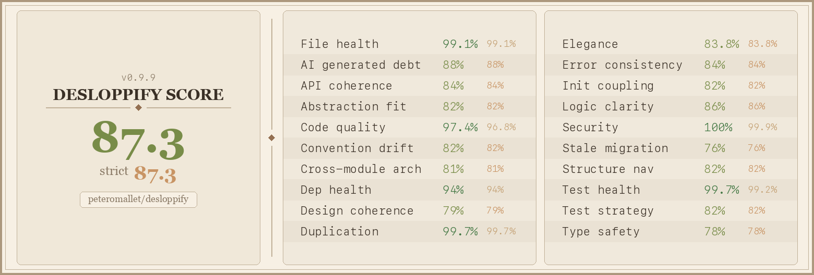
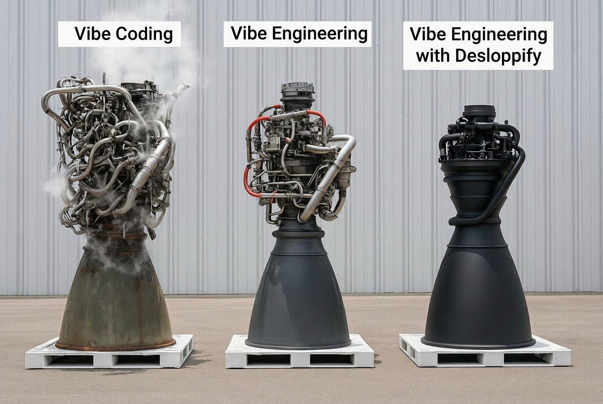

# Desloppify - an agent harness to make your codebase 🤌

[](https://pypi.org/project/desloppify/) 

Desloppify gives your AI coding agent the tools to identify, understand, and systematically improve codebase quality. It combines mechanical detection (dead code, duplication, complexity) with subjective LLM review (naming, abstractions, module boundaries), then works through a prioritized fix loop. State persists across scans so it chips away over multiple sessions, and the scoring is designed to resist gaming.


The score gives your agent a north-star, and the tooling helps it plan, execute, and resolve issues until it hits your target — with a lot of tricks to keep it on track. A score above 98 should correlate with a codebase a seasoned engineer would call beautiful.

That score generates a scorecard badge for your GitHub profile or README:



Currently supports 29 languages — full plugin depth for TypeScript, Python, C#, C++, Dart, GDScript, Go, and Rust; generic linter + tree-sitter support for Ruby, Java, Kotlin, and 18 more. For C++ projects, `compile_commands.json` is the primary analysis path and `Makefile` repositories fall back to best-effort local include scanning.

## For your agent's consideration...

Paste this prompt into your agent:

```
You are a code quality agent using desloppify. Your mission: maximize the strict score
through disciplined iteration. Never cut corners — complete large refactors and small
fixes with equal rigor. Follow agent instructions precisely; do not substitute your
own analysis. Maintain open-source toolchain discipline.

CORE LOOP:
1. desloppify scan --path .
2. desloppify next
3. Fix task completely
4. Run resolve command
5. Repeat 2-4 until complete

Use 'plan/plan queue' to reprioritize. Rescan periodically. Use 'backlog' only for inspection.

---

Improve this codebase quality using the desloppify workflow (requires Python 3.11+).

Setup (run once):

    pip install --upgrade "desloppify[full]"
    desloppify update-skill claude    # pick yours: claude, cursor, codex, copilot, droid, windsurf, gemini
    desloppify exclude vendor build dist node_modules .git

Add .desloppify/ to .gitignore — it contains local state that shouldn't be committed.

Before scanning, check for directories that should be excluded (vendor, build output,
generated code, worktrees, etc.). Exclude obvious ones with `desloppify exclude <path>`.
Share any questionable candidates with me before excluding.

desloppify scan --path .
desloppify next

--path is the directory to scan (use "." for the whole project, or "src/" etc).

Your goal is to get the strict score as high as possible. The scoring resists gaming —
the only way to improve it is to actually make the code better.

Follow agent guidance exactly. Show before/after diffs. Confirm resolution command when complete.
```

## How it works

```
scan ──→ score ──→ review ──→ triage ──→ execute ──→ rescan
  │         │         │          │          │           │
  │     dimensions    │     prioritize    fix it     verify
  │     scored      LLM reviews  & cluster  & resolve  improvements
  │                 subjective   the queue
  │                 quality
  detectors find
  mechanical issues
  (dead code, smells,
  test gaps, etc.)
```

**Scan** runs mechanical detectors across your codebase — dead code, duplication, complexity, test coverage gaps, naming issues, and more. Each issue is scored by dimension (File health, Code quality, Test health, etc.).

**Review** uses an LLM to assess subjective quality dimensions — naming, abstractions, error handling patterns, module boundaries. These score alongside the mechanical dimensions.

**Triage** is where prioritization happens. The agent (or you) observes the findings, reflects on patterns, organizes issues into clusters, and enriches them with implementation detail. This produces an ordered execution queue — only items explicitly queued appear in `next`. Before triage, all mechanical issues are visible in the queue sorted by impact, which can be noisy.

**Execute** is the fix loop: `next` → fix → `resolve` → `next`. Items come from the triaged queue. Autofix handles what it can; the rest needs manual or agent work.

**Rescan** verifies improvements, catches cascading effects, and feeds the next cycle.

State persists in `.desloppify/` so progress carries across sessions. The scoring resists gaming — wontfix items widen the gap between lenient and strict scores, and re-reviewing dimensions can lower scores if the reviewer finds new issues.

## From Vibe Coding to Vibe Engineering

Vibe coding gets things built fast. But the codebases it produces tend to rot in ways that are hard to see and harder to fix — not just the mechanical stuff like dead imports, but the structural kind. Abstractions that made sense at first stop making sense. Naming drifts. Error handling is done three different ways. The codebase works, but working in it gets worse over time.

LLMs are actually good at spotting this now, if you ask them the right questions. That's the core bet here — that an agent with the right framework can hold a codebase to a real standard, the kind that used to require a senior engineer paying close attention over months.

So we're trying to define what "good" looks like as a score that's actually worth optimizing. Not a lint score you game to 100 by suppressing warnings. Something where improving the number means the codebase genuinely got better. That's hard, and we're not done, but the anti-gaming stuff matters to us a lot — it's the difference between a useful signal and a vanity metric.

The hope is that anyone can use this to build something a seasoned engineer would look at and respect. That's the bar we're aiming for.

If you'd like to join a community of vibe engineers who want to build beautiful things, [come hang out](https://discord.gg/aZdzbZrHaY).



---

Issues, improvements, and PRs are hugely appreciated — [github.com/peteromallet/desloppify](https://github.com/peteromallet/desloppify).

MIT License
