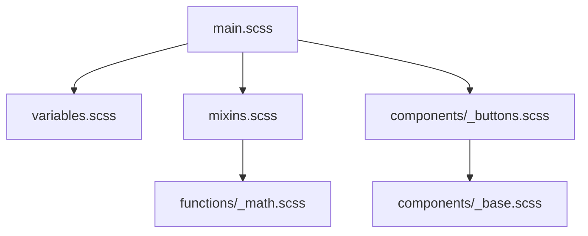

# SCSS Language Plugin for Desloppify

## Overview

The SCSS plugin provides comprehensive analysis capabilities for SCSS (Sassy CSS) files within the Desloppify code quality platform. It integrates industry-standard tools with custom analysis to deliver deep insights into your stylesheet quality.

## Features

### Core Capabilities
- **Stylelint Integration**: Industry-standard CSS/SCSS linting with JSON output
- **Tree-sitter AST Analysis**: Advanced syntax tree analysis for deep code understanding
- **Security Scanning**: Detection of potential security vulnerabilities in CSS
- **Code Metrics**: Comprehensive measurements of code quality
- **Dependency Analysis**: Import graph generation and validation
- **Auto-fix Support**: Automatic correction of common issues

### Analysis Metrics
- **Code Quality**: Linting issues, complexity, maintainability
- **Security**: Potential XSS vectors, unsafe URLs, template injections
- **Structure**: Nesting depth, selector specificity, import graphs
- **Maintainability**: Variable usage, mixin complexity, function analysis
- **Documentation**: Comment density and quality

## Installation

The SCSS plugin is automatically included with Desloppify. Ensure you have the required dependencies:

```bash
# Install stylelint globally
npm install -g stylelint stylelint-config-standard-scss

# Or use Desloppify's integrated tool management
desloppify install-tools scss
```

## Usage

### CLI Usage

```bash
# Basic SCSS analysis
desloppify scan --lang scss --path styles/

# Comprehensive project analysis
desloppify scan --lang scss --path _scss/ --detailed

# Auto-fix issues
desloppify autofix --lang scss --path styles/

# Generate reports
desloppify report --lang scss --output scss-quality.html
```

### Python API

```python
from desloppify.languages.scss import SCSSConfig

# Initialize configuration
config = SCSSConfig()

# Analyze a single file
result = config.analyze_file("styles/main.scss")

# Access analysis results
print(f"Lint issues: {len(result.lint_issues)}")
print(f"Security issues: {len(result.security_issues)}")
print(f"Max nesting depth: {result.metrics.get('max_nesting_depth', 0)}")

# Check for dependencies
dependencies = result.dependencies
print(f"Imported files: {dependencies}")
```

## Configuration

### Plugin Configuration

Create a `.desloppify.scss.yml` file for custom settings:

```yaml
# SCSS-specific configuration
scss:
  # Stylelint configuration
  stylelint:
    config_file: ".stylelintrc.json"
    max_warnings: 1000
    timeout: 30
  
  # Analysis settings
  analysis:
    max_file_size: 10485760  # 10MB
    exclude_patterns:
      - "node_modules/**"
      - "_output/**"
      - "vendor/**"
  
  # Security settings
  security:
    detect_unsafe_urls: true
    detect_template_injections: true
    detect_angular_bindings: true
```

### Stylelint Configuration

The plugin uses stylelint with the following default configuration:

```json
{
  "extends": ["stylelint-config-standard-scss"],
  "rules": {
    "max-nesting-depth": 4,
    "selector-max-specificity": "0,4,0",
    "no-descending-specificity": true,
    "color-no-invalid-hex": true,
    "declaration-block-no-duplicate-properties": true
  }
}
```

## Security Features

### Detected Vulnerabilities

1. **JavaScript URLs**: `url("javascript:alert('XSS')")`
2. **IE Expressions**: `expression(document.write('danger'))`
3. **Template Injections**: `content: "{{ user_input }}"`
4. **AngularJS Bindings**: `ng-bind-html="unsafeContent"`
5. **External Resource Risks**: Unvalidated external imports

### Security Best Practices

```scss
// ✅ SAFE: Relative URLs with proper escaping
$base-url: "https://example.com";
.background {
  background-image: url(#{$base-url}/images/bg.png);
}

// ❌ UNSAFE: JavaScript URLs
.unsafe {
  background-image: url("javascript:alert('XSS')");
}

// ✅ SAFE: CSS variables with validation
:root {
  --safe-color: #ff0000;
}
.element {
  color: var(--safe-color);
}

// ❌ UNSAFE: Template injections
.dangerous {
  content: "{{ user_input }}";  // Potential XSS
}
```

## Code Quality Metrics

### Calculated Metrics

| Metric | Description | Ideal Range |
|--------|-------------|-------------|
| `total_lines` | Total lines of code | Project-dependent |
| `non_empty_lines` | Lines with actual code | High percentage |
| `comment_lines` | Documentation lines | 10-30% |
| `comment_percentage` | Comment density | 10-30% |
| `max_nesting_depth` | Deepest selector nesting | ≤ 4 |
| `variable_count` | SCSS variable usage | Project-dependent |
| `mixin_count` | Mixin definitions | Project-dependent |
| `function_count` | Function definitions | Project-dependent |
| `import_count` | External imports | Minimize |
| `file_size_bytes` | File size in bytes | < 10MB |

### Nesting Depth Guidelines

```scss
// ✅ GOOD: Shallow nesting (depth = 2)
.card {
  &__header {
    color: $primary-color;
  }
}

// ⚠️ CAUTION: Moderate nesting (depth = 4)
.card {
  &__header {
    &--active {
      .icon {
        color: $accent-color;
      }
    }
  }
}

// ❌ BAD: Deep nesting (depth = 6+)
.card {
  &__header {
    &--active {
      .icon {
        &::before {
          .sub-element {
            color: red;
          }
        }
      }
    }
  }
}
```

## Dependency Analysis

### Import Resolution

The plugin analyzes `@import` statements and resolves dependencies:

```scss
// Direct file import - resolved to full path
@import "variables";  // → styles/_variables.scss

// Partial import with extension
@import "mixins.scss";  // → styles/mixins.scss

// External library import
@import "~bootstrap/scss/bootstrap";  // → node_modules/bootstrap/scss/bootstrap.scss

// URL import (security flagged)
@import url("https://fonts.googleapis.com/css?family=Roboto");
```

### Dependency Graph



## Integration with Desloppify

### Workflow Integration

1. **Scan Phase**: Identifies SCSS files and runs initial analysis
2. **Analysis Phase**: Deep dive into code quality, security, and structure
3. **Reporting Phase**: Generates comprehensive reports with actionable insights
4. **Remediation Phase**: Provides auto-fix capabilities and guidance

### Example Workflow

```bash
# 1. Initial scan
desloppify scan --lang scss --path styles/

# 2. Detailed analysis
desloppify analyze --lang scss --detailed --output analysis.json

# 3. Generate HTML report
desloppify report --lang scss --format html --output report.html

# 4. Apply auto-fixes
desloppify autofix --lang scss --path styles/ --dry-run

# 5. Final verification
desloppify verify --lang scss --path styles/
```

## Troubleshooting

### Common Issues

**Issue**: `stylelint not found`
**Solution**: Install stylelint globally or configure path
```bash
npm install -g stylelint
# or
desloppify config set scss.stylelint_path /path/to/stylelint
```

**Issue**: `File too large` errors
**Solution**: Increase max file size or split large files
```yaml
# In .desloppify.scss.yml
scss:
  analysis:
    max_file_size: 20971520  # 20MB
```

**Issue**: Timeout errors
**Solution**: Increase timeout or optimize stylelint config
```yaml
# In .desloppify.scss.yml
scss:
  stylelint:
    timeout: 60  # 60 seconds
```

## Best Practices

### File Organization

```
styles/
├── _variables.scss       # Design tokens and variables
├── _mixins.scss          # Reusable mixins
├── _functions.scss       # SCSS functions
├── _base.scss            # Base styles and resets
├── components/           # Component-specific styles
│   ├── _buttons.scss
│   ├── _cards.scss
│   └── _forms.scss
├── layouts/              # Layout styles
│   ├── _grid.scss
│   └── _header.scss
└── main.scss             # Main entry point
```

### Performance Optimization

```scss
// ✅ EFFICIENT: Use variables for repeated values
$primary-color: #4285f4;
$secondary-color: #34a853;

.button {
  background-color: $primary-color;
  border: 1px solid darken($primary-color, 10%);
}

// ❌ INEFFICIENT: Hardcoded values
.button {
  background-color: #4285f4;
  border: 1px solid #3367d6;
}

.button-secondary {
  background-color: #4285f4;
  border: 1px solid #3367d6;
}
```

## API Reference

### SCSSConfig Class

```python
from desloppify.languages.scss import SCSSConfig

config = SCSSConfig()

# Available methods
result = config.analyze_file("path/to/file.scss")
metrics = config.metrics_calculator.calculate_metrics(content)
dependencies = config.dependency_analyzer.find_dependencies(content, base_path)
security_issues = config.security_analyzer.analyze(content, file_path)
```

### SCSSAnalysisResult Class

```python
# Result structure
result = SCSSAnalysisResult(
    file_path="/path/to/file.scss",
    lint_issues=[
        {
            "line": 42,
            "column": 5,
            "rule": "max-nesting-depth",
            "severity": "error",
            "text": "Expected nesting depth to be no more than 4 (max-nesting-depth)"
        }
    ],
    metrics={
        "total_lines": 150,
        "max_nesting_depth": 5,
        "variable_count": 23,
        "mixin_count": 8
    },
    dependencies=["_variables.scss", "_mixins.scss"],
    security_issues=[
        {
            "type": "security",
            "severity": "high",
            "message": "Potential security issue: url(\"javascript:")",
            "line": 78,
            "file": "/path/to/file.scss"
        }
    ],
    is_success=True
)
```

## Contributing

### Development Setup

```bash
# Clone desloppify
git clone https://github.com/your-repo/desloppify.git
cd desloppify

# Install development dependencies
pip install -e ".[dev]"

# Run tests
pytest desloppify/languages/scss/tests/

# Build documentation
cd desloppify/languages/scss
pydoc-markdown
```

### Testing

The plugin includes comprehensive tests covering:
- File analysis edge cases
- Security pattern detection
- Metrics calculation accuracy
- Dependency resolution
- Error handling scenarios

Run tests with:
```bash
pytest desloppify/languages/scss/tests/ -v
```

## License

This SCSS plugin is licensed under the same terms as Desloppify. See the main LICENSE file for details.

## Support

For issues or questions:
- GitHub Issues: https://github.com/your-repo/desloppify/issues
- Documentation: https://desloppify.com/docs/languages/scss
- Community: https://discord.gg/desloppify

## Changelog

### 1.0.0 (Current)
- Initial release with full SCSS analysis capabilities
- Stylelint integration with security enhancements
- Comprehensive metrics and dependency analysis
- Auto-fix support for common issues

### Roadmap
- **1.1.0**: Enhanced security pattern detection
- **1.2.0**: CSS-in-JS support
- **2.0.0**: Integration with CSS modules and component libraries
